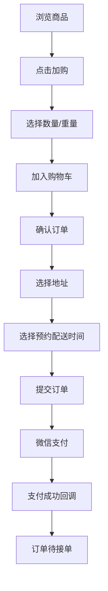
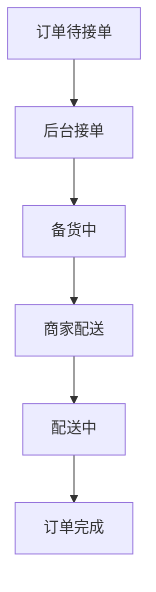
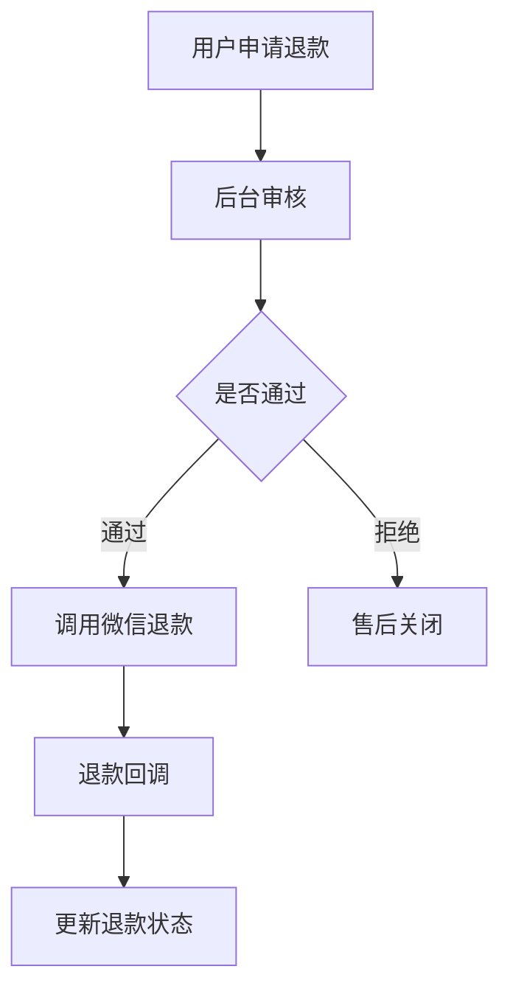

# 页面清单与业务流程

## 1. 微信小程序页面清单

### 1.1 首页

功能：

- 展示门店状态、搜索入口、轮播图、分类入口、推荐商品。
- 支持跳转商品分类、商品详情、购物车。

核心元素：

- 搜索框
- 轮播图
- 商品分类入口
- 推荐商品区
- 底部 Tab

### 1.2 分类商品页

参考样式：左侧分类导航，右侧双列商品卡片。

功能：

- 展示商品分类。
- 展示商品列表。
- 支持搜索。
- 支持筛选，可选。
- 支持点击加购。

商品卡片元素：

- 商品图片
- 商品名称
- 价格/单位，例如 `￥3.99/斤`
- 加购按钮

### 1.3 商品详情页

功能：

- 展示商品大图、名称、价格、单位、库存、详情说明。
- 支持选择购买数量。
- 支持加入购物车。
- 支持立即购买。

### 1.4 加购弹窗

功能：

- 根据商品配置展示销售单位、最小购买量、步进值。
- 支持加减数量。
- 显示当前选择数量和金额。
- 确认加入购物车。

示例：

- 商品：西红柿
- 单位价格：3.99 元/斤
- 最小购买量：0.5 斤
- 步进值：0.5 斤
- 当前选择：1.5 斤
- 当前金额：5.99 元

### 1.5 购物车页

功能：

- 展示已选商品。
- 修改购买数量。
- 删除商品。
- 展示商品总额。
- 去结算。

约束：

- 商品下架或库存不足时需要提示。
- 数量调整必须符合商品步进值。

### 1.6 确认订单页

功能：

- 选择收货地址。
- 选择预约配送时间。
- 展示商品明细。
- 展示配送费。
- 展示应付金额。
- 提交订单并发起微信支付。

### 1.7 支付结果页

功能：

- 展示支付成功或失败。
- 支持跳转订单详情。
- 支持返回首页。

### 1.8 订单列表页

订单筛选：

- 全部
- 待支付
- 待接单
- 备货中
- 配送中
- 已完成
- 退款/售后

### 1.9 订单详情页

功能：

- 展示订单状态。
- 展示预约配送时间。
- 展示收货地址。
- 展示商品明细。
- 展示金额明细。
- 展示支付信息。
- 展示退款信息。
- 支持取消订单或申请退款。

### 1.10 售后申请页

功能：

- 选择售后商品。
- 填写退款原因。
- 填写退款金额，默认不超过可退金额。
- 上传凭证，可选。
- 提交售后申请。

### 1.11 我的页面

功能：

- 用户信息
- 订单入口
- 地址管理
- 客服信息

### 1.12 地址管理页

功能：

- 新增地址
- 编辑地址
- 删除地址
- 设置默认地址

## 2. 管理后台页面清单

### 2.1 登录页

功能：

- 管理员账号密码登录。
- 登录失败提示。

### 2.2 后台首页

功能：

- 今日订单数
- 今日销售额
- 待接单数量
- 退款待处理数量
- 今日预约配送订单

### 2.3 商品分类管理

功能：

- 新增分类
- 编辑分类
- 删除分类
- 分类排序
- 启用/禁用

### 2.4 商品管理

功能：

- 新增商品
- 编辑商品
- 商品图片上传
- 配置销售单位
- 配置单位价格
- 配置最小购买量
- 配置加购步进值
- 配置库存
- 上架/下架
- 商品排序

### 2.5 订单管理

功能：

- 订单列表
- 按状态筛选
- 按预约配送时间筛选
- 按手机号筛选
- 查看订单详情
- 接单
- 标记备货中
- 标记配送中
- 标记完成
- 取消订单
- 发起退款

### 2.6 售后退款管理

功能：

- 查看售后申请
- 审核通过
- 审核拒绝
- 发起微信退款
- 查看退款结果

### 2.7 用户管理

功能：

- 用户列表
- 用户详情
- 查看用户订单
- 查看用户地址

### 2.8 预约配送配置

功能：

- 新增时间段
- 编辑时间段
- 启用/禁用时间段
- 设置每个时间段最大订单数，可选

### 2.9 运营配置

功能：

- 首页轮播图
- 推荐商品
- 公告
- 客服电话

### 2.10 系统配置

功能：

- 门店信息
- 营业时间
- 起送价
- 配送费
- 配送范围
- 微信支付配置

## 3. 核心流程

### 3.1 用户下单支付流程

### 3.2 后台履约流程

### 3.3 退款流程

