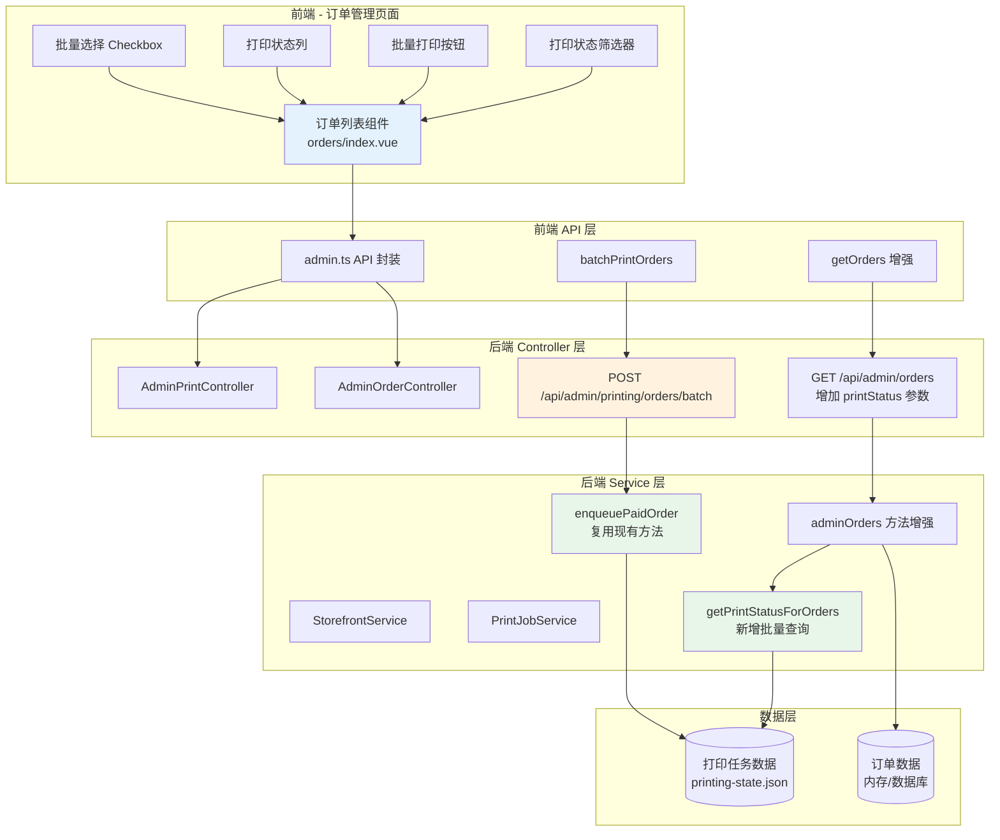
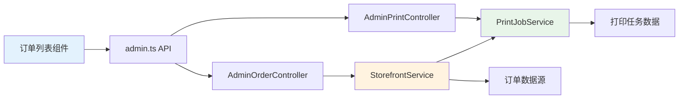
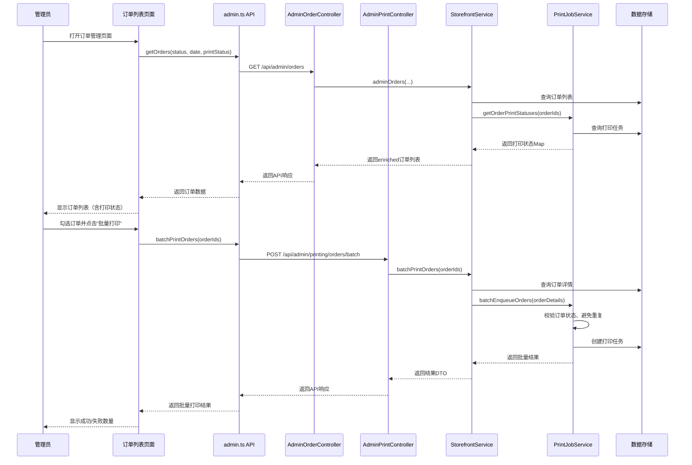

# DESIGN - 打印策略配置

## 整体架构图



---

## 分层设计

### 1. 前端展示层（Vue 3）

#### 1.1 订单列表组件增强
**文件**：`art-lnb-master/src/views/fresh/orders/index.vue`

**新增状态管理**：
```typescript
// 批量选择相关
const selectedOrderIds = ref<number[]>([])
const printStatusFilter = ref<string>('全部')  // 全部/未打印/已打印/打印失败

// 打印状态选项
const printStatuses = ['全部', '未打印', '已打印', '打印失败']
```

**UI 组件结构**：
```
订单管理页面
├── 筛选工具栏
│   ├── 订单状态筛选（已有）
│   ├── 配送日期筛选（已有）
│   └── 打印状态筛选（新增）
├── 批量操作栏（新增）
│   ├── 全选 Checkbox
│   ├── 已选数量显示
│   └── 批量打印按钮
└── 订单表格
    ├── 选择列（新增 Checkbox）
    ├── 顺序列
    ├── 配送分组列
    ├── 收货地址列
    ├── 订单状态列
    ├── 打印状态列（新增）
    ├── 订单信息列
    ├── 预约配送列
    ├── 金额列
    └── 操作列
```

#### 1.2 打印状态显示逻辑
```typescript
interface OrderSummaryWithPrint extends OrderSummary {
  printStatus?: 'NONE' | 'PENDING' | 'SUCCESS' | 'FAILED'
  printJobId?: number
}

const printStatusLabel = (status?: string) => ({
  NONE: '未打印',
  PENDING: '打印中',
  SUCCESS: '已打印',
  FAILED: '打印失败'
})[status || 'NONE']

const printStatusTag = (status?: string) => ({
  NONE: 'info',
  PENDING: 'warning',
  SUCCESS: 'success',
  FAILED: 'danger'
})[status || 'NONE']
```

---

### 2. 前端 API 层（TypeScript）

**文件**：`art-lnb-master/src/api/admin.ts`

#### 2.1 数据模型增强
```typescript
// 订单摘要增加打印状态
export interface OrderSummary {
  // ... 现有字段
  printStatus?: 'NONE' | 'PENDING' | 'SUCCESS' | 'FAILED'
  printJobId?: number | null
}

// 批量打印请求
export interface BatchPrintRequest {
  orderIds: number[]
}

// 批量打印结果
export interface BatchPrintResult {
  success: number
  failed: number
  jobs: PrintJob[]
  errors: Array<{
    orderId: number
    reason: string
  }>
}
```

#### 2.2 新增 API 方法
```typescript
// 获取订单列表（增强版，支持打印状态筛选）
export function getOrders(
  status?: string, 
  deliveryDate?: string,
  printStatus?: string  // 新增参数
) {
  const params: Record<string, string> = {}
  if (status && status !== '全部') params.status = status
  if (deliveryDate) params.deliveryDate = deliveryDate
  if (printStatus && printStatus !== '全部') params.printStatus = printStatus
  
  return request.get<PageResult<OrderSummary>>({
    url: '/api/admin/orders',
    params: Object.keys(params).length ? params : undefined
  })
}

// 批量打印订单
export function batchPrintOrders(orderIds: number[]) {
  return request.post<BatchPrintResult>({
    url: '/api/admin/printing/orders/batch',
    data: { orderIds }
  })
}
```

---

### 3. 后端 Controller 层（Spring Boot）

#### 3.1 AdminOrderController 增强
**文件**：`server/src/main/java/com/xianda/freshdelivery/controller/admin/AdminOrderController.java`

```java
@GetMapping
public ApiResponse<PageResult<AdminOrderDto>> orders(
        @RequestParam(required = false) String status,
        @RequestParam(required = false) @DateTimeFormat(iso = DateTimeFormat.ISO.DATE) LocalDate deliveryDate,
        @RequestParam(required = false) String printStatus  // 新增参数
) {
    return ApiResponse.ok(PageResult.of(
        storefrontService.adminOrders(status, deliveryDate, printStatus)
    ));
}
```

#### 3.2 AdminPrintController 增强
**文件**：`server/src/main/java/com/xianda/freshdelivery/controller/admin/AdminPrintController.java`

```java
// 新增批量打印接口
@PostMapping("/orders/batch")
public ApiResponse<BatchPrintResultDto> batchPrint(
        @Valid @RequestBody BatchPrintRequest request
) {
    return ApiResponse.ok(printJobService.batchEnqueueOrders(request.orderIds()));
}
```

---

### 4. 后端 DTO 层（数据传输对象）

#### 4.1 AdminOrderDto 增强
**文件**：`server/src/main/java/com/xianda/freshdelivery/dto/AdminOrderDto.java`

```java
public record AdminOrderDto(
        Long id,
        String orderNo,
        String status,
        Integer totalAmount,
        String deliverySlot,
        String summary,
        List<String> images,
        String createdAt,
        String latestRefundStatus,
        String latestRefundReason,
        AddressDto address,
        String deliveryDate,
        String deliveryArea,
        String deliveryBuilding,
        String deliveryGroupKey,
        Integer deliverySequence,
        Integer buildingOrderCount,
        Integer buildingOrderPosition,
        Integer sameAddressOrderCount,
        // ===== 新增字段 =====
        String printStatus,      // NONE/PENDING/SUCCESS/FAILED
        Long printJobId          // 关联的打印任务ID（可为null）
) {
}
```

#### 4.2 PrintModels 增强
**文件**：`server/src/main/java/com/xianda/freshdelivery/dto/PrintModels.java`

```java
// 新增批量打印请求
public record BatchPrintRequest(
        @NotNull List<@NotNull Long> orderIds
) {
}

// 新增批量打印结果
public record BatchPrintResultDto(
        int success,
        int failed,
        List<PrintJobDto> jobs,
        List<BatchPrintErrorDto> errors
) {
}

public record BatchPrintErrorDto(
        Long orderId,
        String reason
) {
}
```

---

### 5. 后端 Service 层（业务逻辑）

#### 5.1 PrintJobService 增强
**文件**：`server/src/main/java/com/xianda/freshdelivery/service/PrintJobService.java`

**新增方法 1：批量查询订单打印状态**
```java
/**
 * 批量查询订单的打印状态
 * @param orderIds 订单ID列表
 * @return Map<订单ID, 打印状态>
 */
public synchronized Map<Long, OrderPrintStatus> getOrderPrintStatuses(List<Long> orderIds) {
    Map<Long, OrderPrintStatus> result = new HashMap<>();
    
    for (Long orderId : orderIds) {
        // 查找该订单的所有打印任务
        List<PrintJobState> orderJobs = jobs.values().stream()
                .filter(job -> orderId.equals(job.orderId()))
                .toList();
        
        if (orderJobs.isEmpty()) {
            result.put(orderId, new OrderPrintStatus("NONE", null));
        } else {
            // 优先级：SUCCESS > PENDING/PRINTING/RETRYING > FAILED
            boolean hasSuccess = orderJobs.stream().anyMatch(j -> SUCCESS.equals(j.status()));
            if (hasSuccess) {
                PrintJobState successJob = orderJobs.stream()
                        .filter(j -> SUCCESS.equals(j.status()))
                        .findFirst().orElse(null);
                result.put(orderId, new OrderPrintStatus("SUCCESS", successJob.id()));
            } else {
                boolean hasPending = orderJobs.stream()
                        .anyMatch(j -> PENDING.equals(j.status()) || 
                                      PRINTING.equals(j.status()) || 
                                      RETRYING.equals(j.status()));
                if (hasPending) {
                    PrintJobState pendingJob = orderJobs.stream()
                            .filter(j -> PENDING.equals(j.status()) || 
                                        PRINTING.equals(j.status()) || 
                                        RETRYING.equals(j.status()))
                            .findFirst().orElse(null);
                    result.put(orderId, new OrderPrintStatus("PENDING", pendingJob.id()));
                } else {
                    // 仅有失败任务
                    PrintJobState failedJob = orderJobs.get(0);
                    result.put(orderId, new OrderPrintStatus("FAILED", failedJob.id()));
                }
            }
        }
    }
    
    return result;
}

public record OrderPrintStatus(String status, Long jobId) {}
```

**新增方法 2：批量创建打印任务**
```java
/**
 * 批量创建订单打印任务
 * @param orderDetails 订单详情列表
 * @return 批量打印结果
 */
public synchronized BatchPrintResultDto batchEnqueueOrders(List<OrderDetailDto> orderDetails) {
    List<PrintJobDto> jobs = new ArrayList<>();
    List<BatchPrintErrorDto> errors = new ArrayList<>();
    int successCount = 0;
    
    for (OrderDetailDto order : orderDetails) {
        try {
            // 检查订单是否已支付
            if (!"PAID".equals(order.status()) && !"已支付/待接单".equals(order.status())) {
                errors.add(new BatchPrintErrorDto(order.id(), "订单未支付"));
                continue;
            }
            
            // 检查是否已有成功的打印任务
            String sourceKey = "ORDER:" + order.id();
            boolean hasSuccess = this.jobs.values().stream()
                    .filter(job -> sourceKey.equals(job.sourceKey()))
                    .anyMatch(job -> SUCCESS.equals(job.status()));
            
            if (hasSuccess) {
                errors.add(new BatchPrintErrorDto(order.id(), "订单已有成功的打印任务"));
                continue;
            }
            
            // 创建打印任务（复用现有方法）
            PrintJobDto job = enqueuePaidOrder(order);
            if (job != null) {
                jobs.add(job);
                successCount++;
            } else {
                errors.add(new BatchPrintErrorDto(order.id(), "创建打印任务失败"));
            }
            
        } catch (Exception e) {
            errors.add(new BatchPrintErrorDto(order.id(), e.getMessage()));
        }
    }
    
    return new BatchPrintResultDto(successCount, errors.size(), jobs, errors);
}
```

#### 5.2 StorefrontService 增强
**文件**：`server/src/main/java/com/xianda/freshdelivery/service/StorefrontService.java`

**增强 adminOrders 方法**：
```java
/**
 * 管理后台订单列表（增强版，支持打印状态筛选）
 */
public List<AdminOrderDto> adminOrders(
        String status, 
        LocalDate deliveryDate,
        String printStatus  // 新增参数
) {
    // 1. 查询订单列表（原有逻辑）
    List<AdminOrderDto> orders = // ... 原有查询逻辑
    
    // 2. 批量查询打印状态
    List<Long> orderIds = orders.stream().map(AdminOrderDto::id).toList();
    Map<Long, PrintJobService.OrderPrintStatus> printStatuses = 
            printJobService.getOrderPrintStatuses(orderIds);
    
    // 3. 组装带打印状态的订单列表
    List<AdminOrderDto> enrichedOrders = orders.stream()
            .map(order -> {
                PrintJobService.OrderPrintStatus ps = printStatuses.get(order.id());
                return new AdminOrderDto(
                        order.id(),
                        order.orderNo(),
                        order.status(),
                        order.totalAmount(),
                        order.deliverySlot(),
                        order.summary(),
                        order.images(),
                        order.createdAt(),
                        order.latestRefundStatus(),
                        order.latestRefundReason(),
                        order.address(),
                        order.deliveryDate(),
                        order.deliveryArea(),
                        order.deliveryBuilding(),
                        order.deliveryGroupKey(),
                        order.deliverySequence(),
                        order.buildingOrderCount(),
                        order.buildingOrderPosition(),
                        order.sameAddressOrderCount(),
                        ps != null ? ps.status() : "NONE",
                        ps != null ? ps.jobId() : null
                );
            })
            .toList();
    
    // 4. 按打印状态筛选
    if (printStatus != null && !printStatus.isBlank()) {
        return enrichedOrders.stream()
                .filter(order -> printStatus.equals(order.printStatus()))
                .toList();
    }
    
    return enrichedOrders;
}

/**
 * 批量创建打印任务（控制器调用入口）
 */
public BatchPrintResultDto batchPrintOrders(List<Long> orderIds) {
    // 1. 查询订单详情
    List<OrderDetailDto> orderDetails = new ArrayList<>();
    for (Long orderId : orderIds) {
        try {
            OrderDetailDto order = adminOrder(orderId);
            orderDetails.add(order);
        } catch (Exception e) {
            // 订单不存在，跳过
        }
    }
    
    // 2. 调用 PrintJobService 批量创建
    return printJobService.batchEnqueueOrders(orderDetails);
}
```

---

## 核心组件设计

### 组件 1：批量选择功能

**前端实现**：
```typescript
// 选中状态管理
const selectedOrderIds = ref<number[]>([])
const isAllSelected = computed(() => 
  selectableOrders.value.length > 0 && 
  selectedOrderIds.value.length === selectableOrders.value.length
)

// 可选订单（仅已支付）
const selectableOrders = computed(() => 
  orders.value.filter(order => 
    order.status === '已支付/待接单' || 
    order.status.includes('已支付')
  )
)

// 全选/取消全选
const toggleSelectAll = () => {
  if (isAllSelected.value) {
    selectedOrderIds.value = []
  } else {
    selectedOrderIds.value = selectableOrders.value.map(o => o.id)
  }
}

// 单选
const toggleSelect = (orderId: number) => {
  const index = selectedOrderIds.value.indexOf(orderId)
  if (index > -1) {
    selectedOrderIds.value.splice(index, 1)
  } else {
    selectedOrderIds.value.push(orderId)
  }
}
```

### 组件 2：批量打印操作

**前端实现**：
```typescript
const batchPrinting = ref(false)

const handleBatchPrint = async () => {
  if (selectedOrderIds.value.length === 0) {
    ElMessage.warning('请先选择要打印的订单')
    return
  }
  
  try {
    await ElMessageBox.confirm(
      `确认批量打印 ${selectedOrderIds.value.length} 个订单？`,
      '批量打印',
      { type: 'warning' }
    )
    
    batchPrinting.value = true
    const result = await batchPrintOrders(selectedOrderIds.value)
    
    ElMessage.success(
      `批量打印完成：成功 ${result.success} 个，失败 ${result.failed} 个`
    )
    
    // 清空选中
    selectedOrderIds.value = []
    
    // 刷新列表
    await loadOrders()
    
    // 显示错误详情
    if (result.errors.length > 0) {
      console.warn('批量打印错误：', result.errors)
    }
    
  } catch (error) {
    if (error !== 'cancel' && error !== 'close') {
      ElMessage.error(error instanceof Error ? error.message : '批量打印失败')
    }
  } finally {
    batchPrinting.value = false
  }
}
```

### 组件 3：打印状态筛选

**前端实现**：
```typescript
const printStatusFilter = ref('全部')
const printStatuses = ['全部', '未打印', '已打印', '打印失败']

// 打印状态映射
const printStatusMap: Record<string, string> = {
  '全部': '',
  '未打印': 'NONE',
  '已打印': 'SUCCESS',
  '打印失败': 'FAILED'
}

// 加载订单时传递打印状态
const loadOrders = async () => {
  loading.value = true
  try {
    const mappedPrintStatus = printStatusMap[printStatusFilter.value]
    const result = await getOrders(
      status.value, 
      deliveryDate.value || undefined,
      mappedPrintStatus || undefined  // 传递打印状态
    )
    orders.value = result.items || []
  } catch (error) {
    ElMessage.error(error instanceof Error ? error.message : '订单加载失败')
  } finally {
    loading.value = false
  }
}
```

---

## 模块依赖关系图



---

## 接口契约定义

### 接口 1：获取订单列表（增强）
```
GET /api/admin/orders
Query Parameters:
  - status: string (optional) - 订单状态
  - deliveryDate: string (optional) - 配送日期 YYYY-MM-DD
  - printStatus: string (optional) - 打印状态 NONE/PENDING/SUCCESS/FAILED

Response: ApiResponse<PageResult<AdminOrderDto>>
{
  "code": 200,
  "message": "success",
  "data": {
    "items": [
      {
        "id": 1,
        "orderNo": "ORD001",
        "status": "已支付/待接单",
        "printStatus": "NONE",  // 新增字段
        "printJobId": null,     // 新增字段
        ...
      }
    ],
    "total": 100,
    "page": 1,
    "pageSize": 20
  }
}
```

### 接口 2：批量打印订单
```
POST /api/admin/printing/orders/batch
Request Body:
{
  "orderIds": [1, 2, 3, 4, 5]
}

Response: ApiResponse<BatchPrintResultDto>
{
  "code": 200,
  "message": "success",
  "data": {
    "success": 3,
    "failed": 2,
    "jobs": [
      {
        "id": 101,
        "orderId": 1,
        "orderNo": "ORD001",
        "status": "PENDING",
        ...
      },
      ...
    ],
    "errors": [
      {
        "orderId": 4,
        "reason": "订单未支付"
      },
      {
        "orderId": 5,
        "reason": "订单已有成功的打印任务"
      }
    ]
  }
}
```

---

## 数据流向图



---

## 异常处理策略

### 1. 前端异常处理
```typescript
// 批量打印错误处理
try {
  const result = await batchPrintOrders(selectedOrderIds.value)
  
  if (result.failed > 0) {
    // 部分失败，显示详细信息
    ElMessage.warning({
      message: `批量打印完成：成功 ${result.success} 个，失败 ${result.failed} 个`,
      duration: 5000
    })
    
    // 可选：显示错误详情对话框
    showErrorDetails(result.errors)
  } else {
    ElMessage.success(`批量打印成功：${result.success} 个订单`)
  }
  
} catch (error) {
  // 请求失败
  ElMessage.error(error instanceof Error ? error.message : '批量打印请求失败')
}
```

### 2. 后端异常处理
```java
// PrintJobService.batchEnqueueOrders
public synchronized BatchPrintResultDto batchEnqueueOrders(List<OrderDetailDto> orderDetails) {
    List<PrintJobDto> jobs = new ArrayList<>();
    List<BatchPrintErrorDto> errors = new ArrayList<>();
    int successCount = 0;
    
    for (OrderDetailDto order : orderDetails) {
        try {
            // 业务校验和任务创建
            // ...
        } catch (BusinessException e) {
            errors.add(new BatchPrintErrorDto(order.id(), e.getMessage()));
        } catch (Exception e) {
            errors.add(new BatchPrintErrorDto(order.id(), "系统错误：" + e.getMessage()));
            // 记录日志但不中断批量处理
            log.error("创建打印任务失败，订单ID: {}", order.id(), e);
        }
    }
    
    return new BatchPrintResultDto(successCount, errors.size(), jobs, errors);
}
```

### 3. 业务规则异常
| 异常场景 | 处理方式 |
|---------|---------|
| 订单未支付 | 跳过并记录到 errors，不中断批量 |
| 订单已有成功打印任务 | 跳过并记录到 errors |
| 订单不存在 | 跳过并记录到 errors |
| 打印功能未启用 | 返回 409 错误，中断请求 |
| 部分订单失败 | 成功的继续，失败的记录，返回完整结果 |

---

## 设计原则验证

### ✅ 严格按照任务范围
- 仅实现手动批量打印功能
- 不修改打印代理程序
- 不修改打印小票样式
- 不增加细粒度权限控制

### ✅ 与现有系统架构一致
- 遵循三层架构（Controller → Service → Data）
- 复用 `PrintJobService.enqueuePaidOrder` 方法
- 数据模型遵循现有 Record 风格
- API 响应格式统一使用 `ApiResponse`

### ✅ 复用现有组件和模式
- 复用订单列表页面，不创建新页面
- 复用 Element Plus 组件库
- 复用现有 API 请求封装
- 复用打印任务队列机制

---

## 质量门控检查

- [x] 架构图清晰准确
- [x] 接口定义完整（请求/响应格式明确）
- [x] 与现有系统无冲突（增强现有功能，不破坏原有逻辑）
- [x] 设计可行性已验证（基于现有代码结构）
- [x] 数据流向明确（前端 → API → Controller → Service → Data）
- [x] 异常处理覆盖完整
- [x] 依赖关系清晰（单向依赖，无循环）

---

**设计完成时间**：2026-07-25  
**下一阶段**：原子化任务拆分（Atomize）
