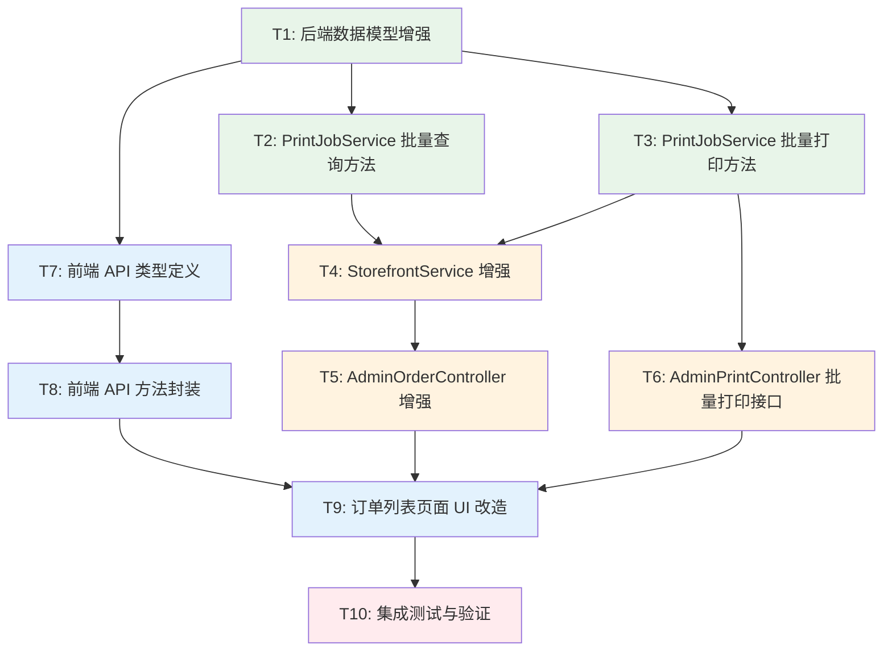

# TASK - 打印策略配置

## 任务依赖关系图

---

## 原子任务列表

### T1: 后端数据模型增强

**输入契约**：
- 现有 `AdminOrderDto.java` 文件
- 现有 `PrintModels.java` 文件
- DESIGN 文档中的数据模型定义

**输出契约**：
- `AdminOrderDto` 增加 `printStatus` 和 `printJobId` 字段
- `PrintModels` 增加 `BatchPrintRequest`、`BatchPrintResultDto`、`BatchPrintErrorDto`、`OrderPrintStatus` 记录类
- 代码编译通过

**实现约束**：
- 使用 Java Record 语法
- 遵循现有命名规范
- 添加必要的验证注解（`@NotNull`）

**验收标准**：
- [ ] `AdminOrderDto` 包含新增字段
- [ ] `PrintModels` 包含所有新增记录类
- [ ] 编译无错误
- [ ] 数据结构符合设计文档

**依赖关系**：
- 前置任务：无
- 后置任务：T2, T3, T7

**文件清单**：
- `server/src/main/java/com/xianda/freshdelivery/dto/AdminOrderDto.java`
- `server/src/main/java/com/xianda/freshdelivery/dto/PrintModels.java`

---

### T2: PrintJobService 批量查询方法

**输入契约**：
- T1 完成的 `OrderPrintStatus` 记录类
- 现有 `PrintJobService.java` 文件
- 现有打印任务数据结构（`PrintJobState`）

**输出契约**：
- 新增 `getOrderPrintStatuses(List<Long> orderIds)` 方法
- 返回 `Map<Long, OrderPrintStatus>`
- 方法能正确计算打印状态优先级（SUCCESS > PENDING > FAILED）

**实现约束**：
- 方法必须是 `synchronized`（与现有方法保持一致）
- 打印状态计算逻辑：
  - 无打印任务 → `NONE`
  - 有 SUCCESS 任务 → `SUCCESS`
  - 有 PENDING/PRINTING/RETRYING 任务 → `PENDING`
  - 仅有 FAILED 任务 → `FAILED`
- 复用现有 `jobs` 字段和常量（`PENDING`, `SUCCESS`, `FAILED` 等）

**验收标准**：
- [ ] 方法签名正确
- [ ] 能正确处理空列表
- [ ] 能正确处理订单无打印任务的情况
- [ ] 能正确处理订单有多个打印任务的情况（取优先级最高的）
- [ ] 编译通过

**依赖关系**：
- 前置任务：T1
- 后置任务：T4

**文件清单**：
- `server/src/main/java/com/xianda/freshdelivery/service/PrintJobService.java`

---

### T3: PrintJobService 批量打印方法

**输入契约**：
- T1 完成的 `BatchPrintResultDto` 和 `BatchPrintErrorDto`
- 现有 `PrintJobService.java` 文件
- 现有 `enqueuePaidOrder` 方法

**输出契约**：
- 新增 `batchEnqueueOrders(List<OrderDetailDto> orderDetails)` 方法
- 返回 `BatchPrintResultDto`
- 方法能处理部分失败场景（不中断整体流程）

**实现约束**：
- 方法必须是 `synchronized`
- 复用现有 `enqueuePaidOrder` 方法创建单个任务
- 业务规则：
  - 订单状态必须包含"已支付"或为 "PAID"
  - 跳过已有 SUCCESS 状态打印任务的订单
  - 每个订单失败独立记录，不影响其他订单
- 异常处理：捕获每个订单的异常，记录到 `errors` 列表

**验收标准**：
- [ ] 方法签名正确
- [ ] 能正确过滤未支付订单
- [ ] 能正确跳过已打印订单
- [ ] 部分失败时，成功的任务正常创建
- [ ] 返回准确的 success/failed 计数
- [ ] 编译通过

**依赖关系**：
- 前置任务：T1
- 后置任务：T4, T6

**文件清单**：
- `server/src/main/java/com/xianda/freshdelivery/service/PrintJobService.java`

---

### T4: StorefrontService 增强

**输入契约**：
- T2 完成的 `getOrderPrintStatuses` 方法
- T3 完成的 `batchEnqueueOrders` 方法
- 现有 `StorefrontService.java` 文件
- 现有 `adminOrders` 方法

**输出契约**：
- 修改 `adminOrders` 方法签名，增加 `printStatus` 参数
- 方法内部调用 `PrintJobService.getOrderPrintStatuses` 组装打印状态
- 支持按打印状态筛选订单
- 新增 `batchPrintOrders(List<Long> orderIds)` 方法

**实现约束**：
- 保持原有订单查询逻辑不变
- 批量查询打印状态（一次调用，避免 N+1 问题）
- 打印状态筛选逻辑清晰
- 复用现有 `adminOrder(Long id)` 方法查询订单详情

**验收标准**：
- [ ] `adminOrders` 方法签名正确（增加 printStatus 参数）
- [ ] 返回的订单列表包含打印状态字段
- [ ] 打印状态筛选功能正常
- [ ] `batchPrintOrders` 方法能正确调用 PrintJobService
- [ ] 编译通过

**依赖关系**：
- 前置任务：T2, T3
- 后置任务：T5

**文件清单**：
- `server/src/main/java/com/xianda/freshdelivery/service/StorefrontService.java`

---

### T5: AdminOrderController 增强

**输入契约**：
- T4 完成的 `StorefrontService.adminOrders` 增强方法
- 现有 `AdminOrderController.java` 文件

**输出契约**：
- `GET /api/admin/orders` 增加 `printStatus` 查询参数
- 参数传递给 `StorefrontService.adminOrders`

**实现约束**：
- 参数使用 `@RequestParam(required = false)` 注解
- 保持原有参数不变（`status`, `deliveryDate`）
- 返回类型不变（`ApiResponse<PageResult<AdminOrderDto>>`）

**验收标准**：
- [ ] 接口签名正确
- [ ] 能正确接收并传递 printStatus 参数
- [ ] 不影响原有功能
- [ ] 编译通过

**依赖关系**：
- 前置任务：T4
- 后置任务：T9

**文件清单**：
- `server/src/main/java/com/xianda/freshdelivery/controller/admin/AdminOrderController.java`

---

### T6: AdminPrintController 批量打印接口

**输入契约**：
- T3 完成的 `PrintJobService.batchEnqueueOrders` 方法
- T1 完成的 `BatchPrintRequest` 和 `BatchPrintResultDto`
- 现有 `AdminPrintController.java` 文件

**输出契约**：
- 新增 `POST /api/admin/printing/orders/batch` 接口
- 接收 `BatchPrintRequest`，返回 `BatchPrintResultDto`
- 接口能正确调用 StorefrontService

**实现约束**：
- 使用 `@PostMapping("/orders/batch")` 注解
- 使用 `@Valid @RequestBody` 验证请求
- 返回 `ApiResponse<BatchPrintResultDto>`
- 注入 `StorefrontService` 依赖

**验收标准**：
- [ ] 接口路径和方法正确
- [ ] 能正确接收请求参数
- [ ] 能正确调用 StorefrontService.batchPrintOrders
- [ ] 返回格式符合规范
- [ ] 编译通过

**依赖关系**：
- 前置任务：T3
- 后置任务：T9

**文件清单**：
- `server/src/main/java/com/xianda/freshdelivery/controller/admin/AdminPrintController.java`

---

### T7: 前端 API 类型定义

**输入契约**：
- T1 完成的后端数据模型
- 现有 `art-lnb-master/src/api/admin.ts` 文件

**输出契约**：
- `OrderSummary` 接口增加 `printStatus` 和 `printJobId` 字段
- 新增 `BatchPrintRequest` 接口
- 新增 `BatchPrintResult` 接口
- 新增 `BatchPrintError` 接口

**实现约束**：
- TypeScript 接口定义
- 遵循现有命名规范（驼峰命名）
- 字段类型与后端对应

**验收标准**：
- [ ] 所有接口定义完整
- [ ] 类型定义与后端 DTO 对应
- [ ] TypeScript 编译无错误

**依赖关系**：
- 前置任务：T1
- 后置任务：T8

**文件清单**：
- `art-lnb-master/src/api/admin.ts`

---

### T8: 前端 API 方法封装

**输入契约**：
- T7 完成的类型定义
- 现有 `getOrders` 方法

**输出契约**：
- 修改 `getOrders` 方法，增加 `printStatus` 参数
- 新增 `batchPrintOrders(orderIds: number[])` 方法

**实现约束**：
- 使用现有 `request.get` 和 `request.post` 封装
- 参数处理逻辑与现有方法一致
- API 路径与后端对应

**验收标准**：
- [ ] `getOrders` 方法签名正确
- [ ] `batchPrintOrders` 方法签名正确
- [ ] 请求路径和参数正确
- [ ] TypeScript 编译无错误

**依赖关系**：
- 前置任务：T7
- 后置任务：T9

**文件清单**：
- `art-lnb-master/src/api/admin.ts`

---

### T9: 订单列表页面 UI 改造

**输入契约**：
- T8 完成的 API 方法
- T5 完成的后端接口
- T6 完成的批量打印接口
- 现有 `art-lnb-master/src/views/fresh/orders/index.vue` 文件

**输出契约**：
- 订单表格增加"选择"列（Checkbox）
- 订单表格增加"打印状态"列
- 筛选工具栏增加"打印状态"筛选器
- 新增批量操作栏（全选、已选数量、批量打印按钮）
- 批量打印功能完整实现

**实现约束**：
- 使用 Element Plus 组件（ElCheckbox, ElTag, ElButton, ElSegmented）
- 遵循 Vue 3 Composition API 风格
- 保持与现有 UI 风格一致
- 仅已支付订单可选择
- 批量打印前弹窗确认
- 批量打印后显示成功/失败反馈

**验收标准**：
- [ ] UI 布局合理，不影响现有功能
- [ ] 打印状态列正确显示（未打印/打印中/已打印/打印失败）
- [ ] 打印状态筛选器工作正常
- [ ] 批量选择功能正常（全选/单选/取消）
- [ ] 仅已支付订单可选择
- [ ] 批量打印按钮状态正确（未选中时禁用）
- [ ] 批量打印操作正确调用 API
- [ ] 批量打印结果正确反馈给用户
- [ ] 批量打印后刷新列表
- [ ] TypeScript 编译无错误
- [ ] 页面无控制台错误

**依赖关系**：
- 前置任务：T5, T6, T8
- 后置任务：T10

**文件清单**：
- `art-lnb-master/src/views/fresh/orders/index.vue`

---

### T10: 集成测试与验证

**输入契约**：
- T9 完成的前端页面
- 所有后端接口已实现
- 现有打印代理程序运行正常

**输出契约**：
- 完整的功能测试报告
- 所有验收标准通过
- 发现的问题已修复

**实现约束**：
- 启动后端服务（Spring Boot）
- 启动前端服务（Vue 3）
- 使用浏览器进行功能测试
- 检查后端日志无错误

**验收标准**：
- [ ] 订单列表正确显示打印状态
- [ ] 打印状态筛选功能正常
- [ ] 批量选择功能正常
- [ ] 批量打印接口正常（测试 3-5 个订单）
- [ ] 已打印订单自动跳过
- [ ] 未支付订单无法选择或被过滤
- [ ] 批量打印后打印代理能正常领取任务
- [ ] 打印任务状态实时更新
- [ ] 部分失败场景处理正确
- [ ] 不影响现有自动打印功能
- [ ] 性能符合要求（订单列表加载时间 < 2秒）

**依赖关系**：
- 前置任务：T9
- 后置任务：无

**测试场景清单**：
1. 正常流程：选择 5 个已支付订单批量打印
2. 边界场景：选择 1 个订单批量打印
3. 异常场景：选择包含未支付订单（应被过滤）
4. 异常场景：选择已打印订单（应被跳过）
5. 筛选场景：按"未打印"筛选订单
6. 筛选场景：按"已打印"筛选订单
7. 兼容性：验证不影响现有功能

---

## 任务执行顺序

### 阶段 1：后端基础（并行）
- T1: 后端数据模型增强

### 阶段 2：后端服务层（并行）
- T2: PrintJobService 批量查询方法
- T3: PrintJobService 批量打印方法

### 阶段 3：后端控制层（串行）
- T4: StorefrontService 增强
- T5: AdminOrderController 增强
- T6: AdminPrintController 批量打印接口

### 阶段 4：前端 API 层（串行）
- T7: 前端 API 类型定义
- T8: 前端 API 方法封装

### 阶段 5：前端 UI 层（串行）
- T9: 订单列表页面 UI 改造

### 阶段 6：测试验收（串行）
- T10: 集成测试与验证

---

## 复杂度评估

| 任务 | 复杂度 | 预计时间 | 风险等级 |
|------|--------|----------|----------|
| T1   | 低     | 15 分钟  | 低       |
| T2   | 中     | 30 分钟  | 低       |
| T3   | 中     | 30 分钟  | 中       |
| T4   | 中     | 40 分钟  | 中       |
| T5   | 低     | 10 分钟  | 低       |
| T6   | 低     | 15 分钟  | 低       |
| T7   | 低     | 15 分钟  | 低       |
| T8   | 低     | 20 分钟  | 低       |
| T9   | 高     | 90 分钟  | 中       |
| T10  | 中     | 60 分钟  | 低       |

**总预计时间**：约 5-6 小时

**风险说明**：
- T3（批量打印方法）：业务逻辑较复杂，需仔细处理异常
- T4（StorefrontService 增强）：涉及现有代码修改，需确保不破坏原有功能
- T9（订单列表 UI 改造）：工作量最大，需要处理多种交互场景

---

## 质量门控

- [x] 任务覆盖完整需求（自动打印已有、手动批量打印全覆盖）
- [x] 依赖关系无循环（严格的有向无环图）
- [x] 每个任务可独立验证（都有明确的验收标准）
- [x] 复杂度评估合理（高复杂度任务 T9 已拆分详细）
- [x] 输入/输出契约清晰
- [x] 实现约束明确

---

**任务拆分完成时间**：2026-07-25  
**下一阶段**：审批确认（Approve）
